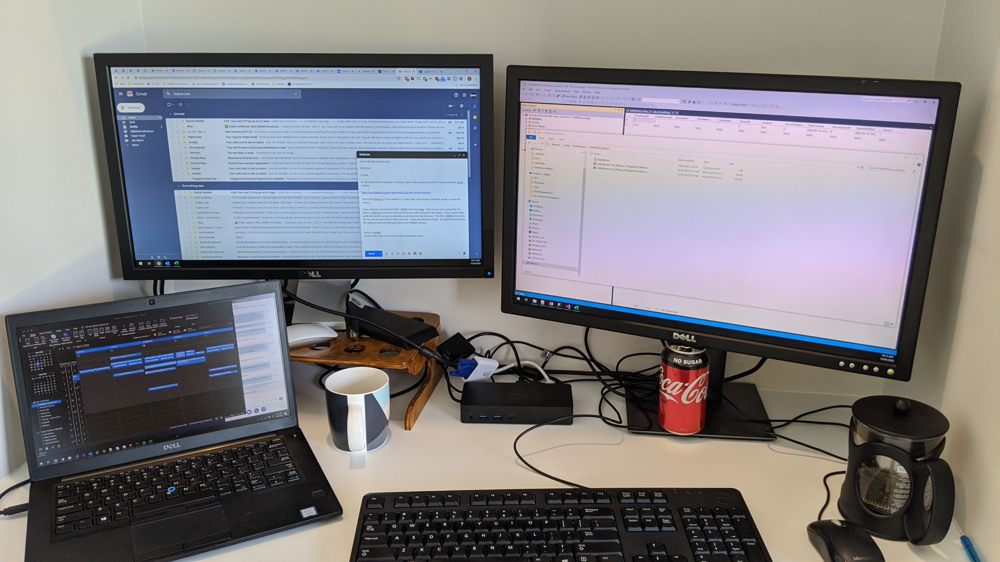
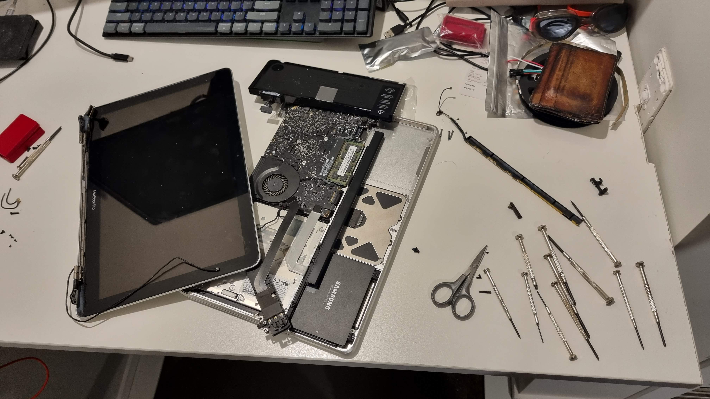
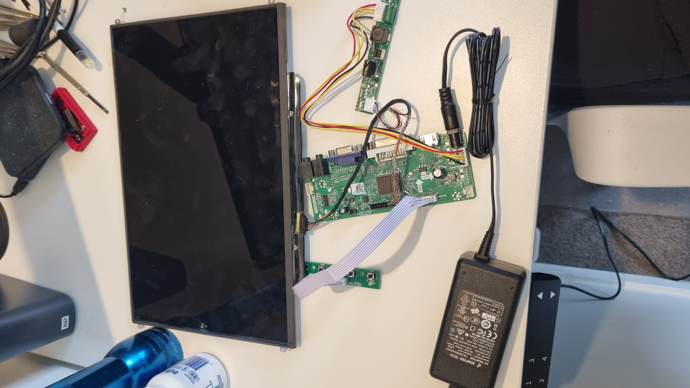

+++
date = '2026-08-22T08:38:50+10:00'
title = 'A Home Made Portable Monitor'
+++

For a long time I wanted a 2nd monitor that was portable, but until very recently it was prohibitively expensive.  Even though the prices had dropped dramatically I still wanted to see if this was possible.

In my [other post](../is-nomadic-work-actually-possible) about my obsession with working on 2 screens I suggested I might write up my experience with repurposing an old laptop screen as a portable monitor.

The problem was, I didn't even have an old laptop.

## My Intel Macbook Pro
It wasn't until Christmas 2021 that I replaced my [Intel MacBook Pro](https://support.apple.com/en-us/111341) with a shiny new [M1 MacBook Pro](https://support.apple.com/en-au/111902).

My old Intel Macbook Pro worked really well for 11 years old, but during COVID lockdowns I had gotten used to working on 3 screens using my work laptop and a USB-C docking station.  My Intel Macbook Pro didn't have USB-C or the graphics capacity for 2 external screens.

I felt bad destroying a perfectly working laptop, but:

* The battery didn't last very long
* The DVD drive hadn't worked for years
* I had replaced the HDD with an SSD a few years earlier that I wanted to keep
* One of the internal speakers had stopped working

It probably wasn't going to be worth much to sell.

I harvested the parts that I wanted, the screen and the SSD, and surprisingly someone on Facebook Marketplace wanted the rest!  It felt good that none of it went to waste!

## Getting a Controller
I've never really been a hardware person.  I've dabbled now and again upgrading computers for friends and reading up on processor performance when purchasing new, but never really got into components.

I really wanted a USB-C powered controller.  One cable from laptop to screen was the ultimate goal.  I searched the internet high and low, but couldn't find a controller that worked purely off USB-C and worked with the LCD display I had.  I ended up with [this one](https://www.aliexpress.com/item/1005008103685096.html) with HDMI and 5v DC power.

Here's it wired up.

And here's a photo of the entire solution in the old Macbook Pro case with a home made stand.

Pretty chuffed with the setup, but one thing for sure is the 1280x800 resolution is hard to look at compared to the 1512x982 on my new laptop.

It was a good learning exersize and I am happy I did the project, but it's pretty fragile.  I am not sure how many trips it will survive, especially in a suitcase getting bashed around airports.

Ultimately I think I will probably get an iPad and use [Sidecar](https://support.apple.com/en-au/102597) which is a wireless solution that looks really slick.