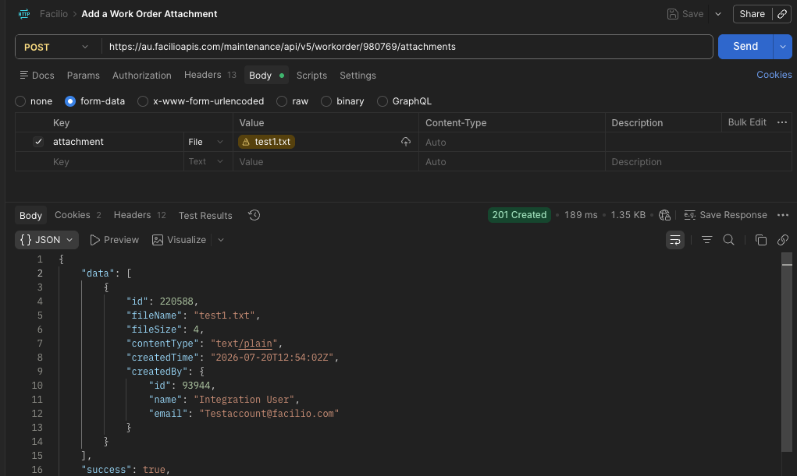
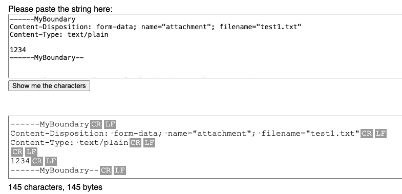
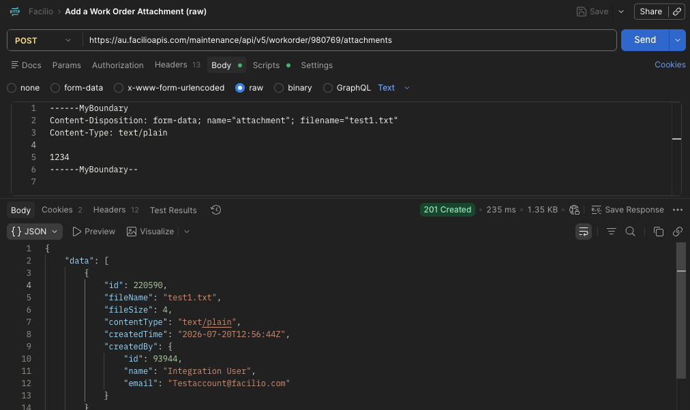
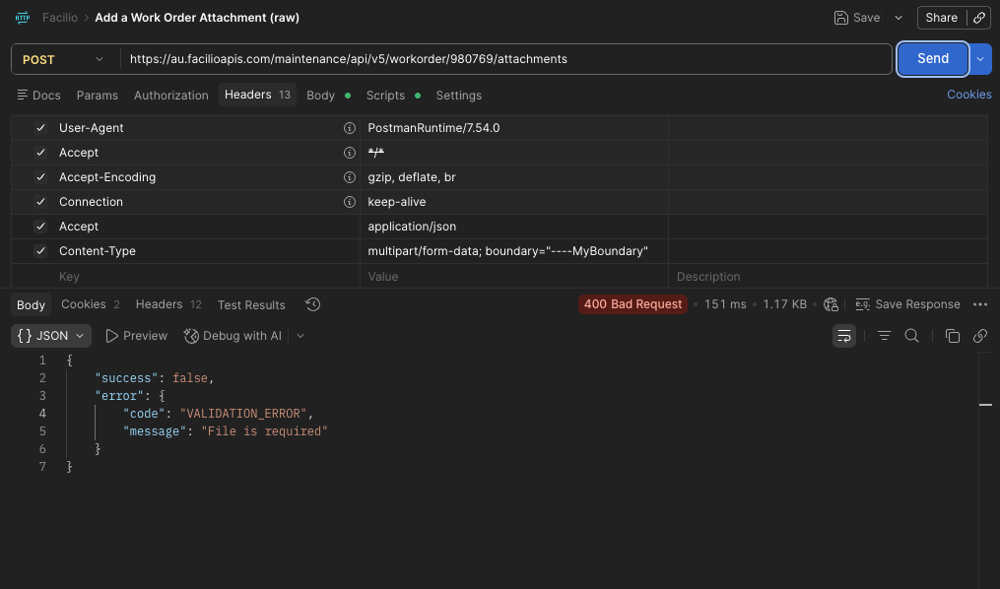
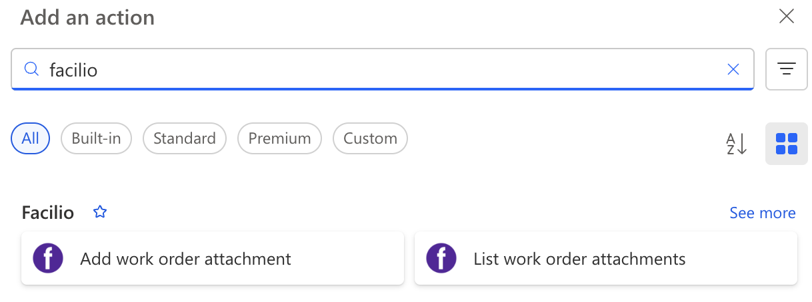

+++
date = '2026-07-20T23:05:57+10:00'
draft = true
title = 'An unplanned Side Quest into multipart/form-data'
+++

## The Task

Recently I was asked to update an integration with [Facilio](https://facilio.com/).  The integration sends maintenance requests from one system to Facilio Work Orders.  The task was to add attachments into the integration.  Facilio have an endpoint in their [REST API](https://facilio.com/developers/docs/api-reference/) for uploading attachments, but rather unusually it accepts multipart/form-data body rather than json or xml.

This integration is built with Power Automate and mostly with the HTTP Action.  A fact that will become very important later.

## The Side Quest

I wasn't sure how to actually configure the HTTP Action to send a multipart content type, but there are a few ([link 1](https://community.powerplatform.com/forums/thread/details/?threadid=5924f7c6-2352-4c2e-a748-f29e1a43a96c),[link 2](https://manish-solanki.com/how-to-post-multipart-form-data-using-http-connector-in-power-automate/), [link 3](https://powergi.net/blog/send-multi-form-data-in-power-automate-http-requests/)) articles online that show the Power Automate way to send multipart/form-data.

I got this working pretty quickly POSTing to a [webhook.site](https://webhook.site/) endpoint, but to the actual Facilio Endpoint was another matter.

## Understanding some of the Power Automate Magic

After a lot of testing and getting nowhere, checking different payloads and header values, Claude worked out that Power Automate was messing around with the Content-Type Header.

```
{
  "$content-type": "multipart/form-data; boundary=----MyBoundary1234567890",
  "$multipart": [
    {
      "headers": {
        "Content-Disposition": "form-data; name=\"attachment\"; filename=\"test.txt\"",
        "Content-Type": "text/plain"
      },
      "body": "1234"
    }
  ]
}
```

Specifying the above body in the HTTP Action lead to an actual Content-Type Value of:

```
multipart/form-data; boundary="----MyBoundary1234567890" 
```
Notice the additional double quotes in the boundary attribute.  While quotes around the boundary attribute is part the spec ([RFC 2046](https://datatracker.ietf.org/doc/html/rfc2046)), it appears that the Facilio API did not accept it.  Claude worked out that the Facilio API is being served by a Java/servlet-based API based on the cookies it issues and that maybe it wasn't stripping the quotes.

I tried all sorts to get around it, but the result seems to be that if you use the json syntax above, Power Automate will always overwrite the Content-Type header.  Doesn't help that it's an "undocumented" feature.

## Plan B - Write the request body manually

The only way forward seemed to be to abandon the "undocumented" feature and manually create the multipart/form-data body myself so I can control the boundary value without quotes in Power Automate.

To try and speed up that process I jumped to Postman to get the syntax correct.



Getting the request working was trivial, just set form-data in the body, add a name and choose a file, Postman does it's thing and success, a 200 response.

Now to try and replicate this using a RAW body in Postman for use eventually back in Power Automate.

I could not get it working, I checked everything I could between my 2 requests they were identical.  I even POSTed them both to [webhook.site](https://webhook.site/) to see if I could see the difference there and they were both identical.

Back to Claude.  We jumped into comparing HEX values of the body as Claude told me the most likely issue was line endings.  I had double checked that before.  See here CRLF line endings.


Sure enough, the system the above screenshot is from was lying.  The HEX values of the working payload had `\r\n` line endings, but the manual one I had created were only `\n`.

A quick POSTman Pre-Script to replace `\n` with `\r\n` and eventually a 200 result with the RAW body and a ASCII file.  Massive sigh of relief.



And just to prove the point to myself, I added quotes to the boundary attribute and it failed.



But then how to replicate this in Power Automate which uses `\n` line endings by default.  Well a whole load of decoding seemed to be the recommendation.

```
concat(
  '--',
  outputs('Boundary'),
  decodeUriComponent('%0D%0A'),
  'Content-Disposition: form-data; name="attachment"; filename="textfile.txt"',
  decodeUriComponent('%0D%0A'),
  'Content-Type: text/plain',
  decodeUriComponent('%0D%0A'),
  decodeUriComponent('%0D%0A'),
  '1234',
  decodeUriComponent('%0D%0A'),
  '--',
  outputs('Boundary'),
  '--',
  decodeUriComponent('%0D%0A')
)
```
Well that worked... for ASCII files...

## Time to try a binary file

It's most likely that the files being transfered are images.

Replaced the `1234` with a `base64ToBinary()` function to take the base 64 from the source system and add it to the multipart/form-data body.

And it worked! 200 response code.  Delighted!  Until I got someone to check the file. "Corrupt, can't be read" was the response.  Damn.

Ok, what now Claude?  Well turns out that no matter what you try the Power Automate HTTP Action will ALWAYS send string in the body, even if you use one of the `binary()` functions the HTTP action will just stringify that binary before sending.  There's no way around this.

## Plan D - An Azure Function

Claude is suggesting an Azure Function to make the multipart/form-data request and I'm close to admitting defeat.  I know I can have an azure function spun up super quick.

The problem with this solution is the maintenance.  There's no source control I can store the code in, and not really anyone to look after the Azure function ongoing.  So I'd really prefer it to be a last resort.

Let's call that Plan D and see what else we could do natively in Power Platform.

## Plan C - Power Platform Custom Connector

The only other option was a Power Platform Custom Connector.  In theory, grab an openapi spec, dump it into the UI and it magically makes you Power Automate Actions for each endpoint in the specification.

Too good to be true?

Well 2 problems with Facilio's openapi spec.
1. It's version 3. [Power Platform only supports version 2](https://learn.microsoft.com/en-us/connectors/custom-connectors/define-openapi-definition).
2. It's not valid. (This blog is long enough, so I'll spare you the detail.)

I ended up hand crafting an openapi 2.0 specification for the single endpoint I needed as the tooling that supposedly reverse engineers them are not very efficient.

Dumped that into the Custom Connector Wizard thing and voila, actions appeared in the Flow Editor.



I ended up adding a 2nd endpoint just to see how easy it would be to update.  What I like about it is you then use the Custom Connection to create a normal connection like you would to Office or Sharepoint and all your flows can use the same connection.  

All Developers know that some "quick fixes" just explode into 3 or 4 day marathons that are 1 step forward, 2 back and this was one of them.

I'm really happy that I found a native Power Automate solution.  I might look at custom connectors for other common integrations.