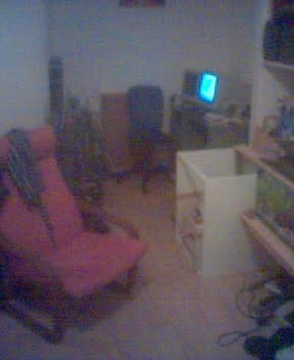
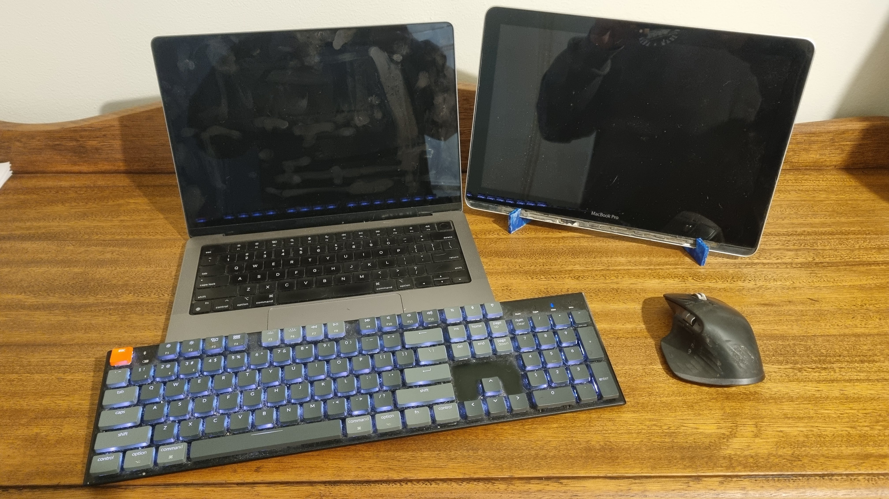

+++
date = '2026-08-11T22:21:16+01:00'
title = 'Is Nomadic Work Actually Possible'
+++

I've always wondered if I could. You know those videos from Bali showing digital nomads working on a laptop in a cafe? I've never seen myself being able to work effectively that way.

For me, the blocker was always a second screen.

## Screen real estate
I first got a dual-screen setup somewhere between 2000 and 2002.

Two 17" CRTs. They were massive and took up nearly the whole desk. Digital photography was still in its infancy, so this photo looks like it was taken on a potato, but it's the only one I have!

I immediately loved working on two screens, and I've never worked on a single screen since.

The idea of going "nomadic" and working remotely started when I was [backpacking](https://maps.app.goo.gl/5tVopnGiC4dfxX2q8) in 2008. I had a few websites I maintained for customers and was able to do that while on the road, but having to work from just a single laptop screen was frustrating. Looking back on that now, I wish I had perservered, but it was a lot of hastle for little cash back then.

Since then, the idea of working like this has grown, and since Covid even more so, as I've mostly worked from home since then.

## An opportunity to try it
Fast forward 18 years, and I had an opportunity to try a working holiday while visiting family. Here's the setup I put together:

* [M1 MacBook Pro](https://support.apple.com/en-au/111902)
* [Keychron](https://keychron.com.au/) K5 keyboard
* [Logitech MX Master 3S](https://www.logitech.com/en-au/shop/p/mx-master-3s) mouse
* Homemade screen based on my old [Intel MacBook Pro](https://support.apple.com/en-us/111341)

I was a bit nervous about taking the second screen in my hand luggage because it is a bit delicate. I'll do another blog into why. Getting it in and out a number of times to be x-rayed and trying to explain to security why I had two laptops seemed like too much, so I thought the less risky option would be to put it in my hold luggage.

Fortunately, it survived, and it worked really well while staying fairly compact.

## The future
Definitely proved to me that I can work remotely and reasonably nomadically, so stay tuned to see where my homemade second monitor goes next!